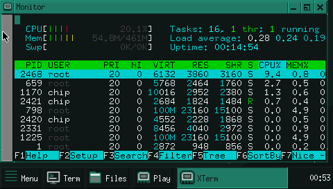
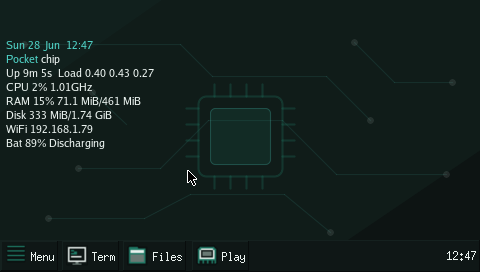
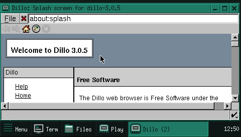
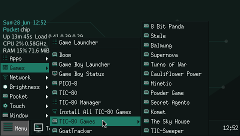
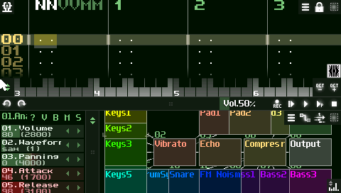
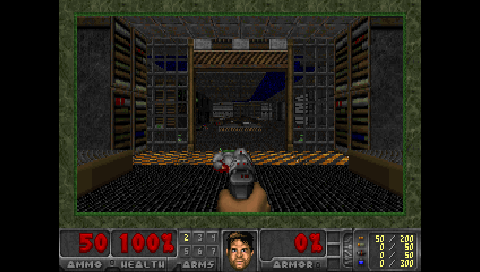

# x-chip-tinycore-xorg

TinyCore Linux image builder for NextThing CHIP / PocketCHIP, with a lightweight
Xorg/JWM desktop.

It builds one flashable rootfs tar:

```sh
xorg-rootfs.tar.gz
```

Target:

- TinyCore/CorePure armhf 16.x
- Linux `6.18.37-chip-tc`
- NAND/UBIFS boot through `x-chip-tools`
- LCD console, serial console, WiFi, SSH
- Xorg/JWM desktop starts by default after boot
- fbdev default Xorg driver, fixed JWM tray, flwm fallback, aterm, xinput
- fbturbo sample config kept for later, but not loaded by default

## Live PocketCHIP Preview

These are direct captures from the real PocketCHIP screen, not mockups. The
first capture shows the current lightweight desktop monitor view: Xorg/JWM,
SSH/runtime services, and `htop` running on the `480x272` LCD with about 55 MB
of RAM in use.



More live views from the same image:

| Desktop | Dillo | Games |
| --- | --- | --- |
|  |  |  |

SunVox running fullscreen from the optional music tools:



Doom running fullscreen through Chocolate Doom and Freedoom:



## Current Status

Base inherited from the working headless PocketCHIP image:

- FEL flash to NAND
- LCD console
- PocketCHIP keyboard
- internal RTL8723BS WiFi
- SSH login as `chip`
- RTL8812AU USB WiFi module built as optional secondary adapter

Desktop status:

- `Xorg.tcz`, `xf86-video-fbdev.tcz`, `flwm.tcz`, `jwm.tcz`, `aterm.tcz`,
  `xrandr.tcz`, `xinput.tcz`, and app dependencies like `libffi6.tcz` are
  preseeded into `/tce/optional`
- Xorg/JWM starts automatically from the boot runtime via `x-chip-desktop-start`
- tty1, serial console, USB debug networking, and SSH remain available as
  recovery paths
- the current stable path is fbdev + JWM on VT2; fbturbo is not loaded because
  the available fbturbo module targets an older Xorg video ABI

## Quick Flash From a PC

Use a Linux PC. Ubuntu or Debian is the easiest path for beginners. This erases
the PocketCHIP NAND rootfs.

The helper script finds and downloads the latest public release by itself, so
these commands stay the same for every future release:

<https://github.com/marceloeatworld/x-chip-tinycore-xorg/releases/latest>

On Ubuntu/Debian, copy and paste:

```sh
sudo apt-get update
sudo apt-get install -y git curl ca-certificates

git clone https://github.com/marceloeatworld/x-chip-tinycore-xorg.git
cd x-chip-tinycore-xorg

./scripts/flash-release-pocketchip.sh --install-deps
```

On NixOS:

```sh
git clone https://github.com/marceloeatworld/x-chip-tinycore-xorg.git
cd x-chip-tinycore-xorg

nix shell nixpkgs#ubootTools nixpkgs#sunxi-tools -c ./scripts/flash-release-pocketchip.sh
```

The script downloads the release rootfs and `.sha256`, verifies the image,
installs or checks the flashing commands, verifies the flash helper downloads
against the SHA256 values pinned in `config.env`, downloads `x-chip-tools` and
installer files on first run, then asks you to type `FLASH` before erasing
NAND. Users do not need to look up SHA values manually. If upstream re-uploads
a helper asset and the pinned check fails, `--refresh-flash-shas` trusts the
GitHub API values instead.

On other Linux distros, run `./scripts/flash-release-pocketchip.sh`. If automatic
package install is unavailable, it prints the missing command names.

If the script reports a missing NAND SPL image builder, the host flashing tools
are incomplete. The old `x-chip-tools` code calls the tool
`sunxi-nand-image-builder`; many Ubuntu/Debian `sunxi-tools` packages install
`sunxi-fel` but not that old misc tool. Newer U-Boot builds provide the same
builder as `sunxi-spl-image-builder`. The flash scripts accept either command
name, and also honor `SNIB=/path/to/tool` for a custom build.

To test the download, SHA check, and command detection without writing NAND:

```sh
./scripts/flash-release-pocketchip.sh --dry-run
```

To also run the lower-level flasher preflight without writing NAND, use:

```sh
./scripts/flash-release-pocketchip.sh --preflight
```

FEL/GND connection:

1. Power the PocketCHIP off.
2. Find the **FEL** and **GND** pins or pads on the CHIP board.
3. Put one jumper wire between **FEL** and **GND**. Any **GND** pin is fine.
4. Keep **FEL** connected to **GND**, then plug the CHIP/PocketCHIP micro-USB
   cable into the Linux PC.
5. Run the flash command above.
6. When the script prints `flash complete`, unplug USB, remove the **FEL** to
   **GND** jumper, then power on normally.

Do not connect **FEL** to **5V**, **VBAT**, or **3V3**. It only needs to touch
**GND** while the device starts in FEL flashing mode.

Advanced: if the PocketCHIP USB cable is connected to another Linux host over
SSH, use the lower-level script with a rootfs file you already downloaded:

```sh
./scripts/05-flash-via-host.sh --host my-linux-host --rootfs /path/to/x-chip-tinycore-xorg-pocketchip-6.18.37-chip-tc.rootfs.tar.gz --flash
```

## Personal Build

Use this when the device should join your WiFi and accept your SSH key:

```sh
make deps
cp secrets.env.example secrets.env
$EDITOR secrets.env
make container-build
make verify
```

The rootfs assembler must preserve root-owned files, setuid bits, and static
console device nodes. Use `make container-build` for the normal path; local
non-root builds require `fakeroot`.

Then flash:

```sh
make flash-local
```

or:

```sh
FLASH_HOST=my-linux-host make flash-host
```

## Desktop

Boot normally. TinyCore shows boot logs, prepares the console and services, then
starts the default fbdev/JWM desktop on VT2. The console, USB debug, WiFi and
SSH paths remain available for recovery.

Start or restart the desktop manually:

```sh
x-chip-desktop-start
```

The default JWM desktop is intentionally minimal: a quiet background, a compact
bottom bar with `Menu`, `Term`, `Files`, task list, and clock, plus organized
menus for everything else. The graphical defaults are Dillo, PCManFM, Leafpad,
and Geany; terminal fallbacks like `links`, `nano`, and `mc` remain available
under `Apps`. It does not auto-open a terminal on startup. Default app profiles
hide nonessential panes and use `Luxi Sans 9` for UI text plus `Luxi Mono 9`
for text editors so Geany, Dillo, PCManFM, and Leafpad fit the PocketCHIP's
`480x272` LCD.
JWM uses a tiny local XPM icon set from
`/usr/local/share/x-chip/xorg/icons` via `IconPath`, so menus and tray buttons
get consistent icons without loading a full desktop icon theme. GTK apps use the
matching `x-chip` icon theme from `/usr/local/share/icons/x-chip`, covering
PCManFM folders/files and the common toolbar actions.
The default wallpaper is `/usr/local/share/x-chip/xorg/wallpapers/pocket-core.png`,
a lightweight `480x272` PocketCHIP-specific background built to keep the tray
and small windows readable.

Lightweight system controls are built in without NetworkManager or a desktop
settings daemon:

- `x-chip-brightness` changes `/sys/class/backlight/*/brightness` and saves the
  default in `/usr/local/etc/x-chip/display.conf`
- `x-chip-desktop-stats` shows or hides the Conky desktop stats and saves the
  on/off state in `/usr/local/etc/x-chip/desktop-stats.conf`
- `x-chip-wifi-menu` keeps the internal RTL8723BS adapter as the client/default
  route interface and uses an optional RTL8812AU USB adapter for external scans
  when present
- WiFi setup writes `/etc/wpa_supplicant.conf`, then restarts
  `wpa_supplicant` and DHCP on the internal adapter
- JWM exposes WiFi under `Network`, brightness under its own `Brightness`
  menu, battery/WiFi/system stats under `Pocket -> Status`, and close/restart
  actions under `Window`; brightness and close buttons are intentionally not
  placed in the tray

Use flwm instead:

```sh
X_CHIP_DESKTOP_WM=flwm x-chip-desktop-start
```

Desktop autostart defaults live in:

```text
/usr/local/etc/x-chip/desktop.conf
```

Set `X_CHIP_DESKTOP_AUTOSTART=0` there to boot to console only. If X is already
running, `x-chip-desktop-start` reapplies touch calibration and restarts JWM.

The JWM root menu only opens on right-click/touch button 3, and the desktop menu
does not include direct reboot or power-off entries. This keeps a touchscreen
tap from accidentally shutting down the desktop session.

Xorg/session logs go to:

```sh
/tmp/x-chip-startx.log
/tmp/x-chip-xorg.log
/tmp/Xorg.0.log
/tmp/x-chip-x-calibration.log
/var/log/x-chip-desktop.log
```

The active Xorg config is:

```text
/usr/local/etc/X11/xorg.conf.d/20-pocketchip-fbdev.conf
```

Touchscreen calibration is stored in one plain text file:

```text
/usr/local/share/x-chip/xorg/touchscreen-calibration.matrix
```

The source default used by the image builder is versioned here:

```text
config/pocketchip-touchscreen-calibration.matrix
```

The current default matrix is calibrated for this PocketCHIP panel:

```text
-1.069801149 0.001502438 1.036070831 0.016517502 -1.201373468 1.045724772 0 0 1
```

To calibrate once and save the reusable matrix, start X and run:

```sh
DISPLAY=:0 x-chip-touch-calibrate
```

The calibrator uses five positions: the four usable corners plus the center. It
records three taps per position, averages them, writes the matrix file, and
reapplies it to the running X session. You can also edit that single matrix line
manually, then either restart X or run:

```sh
DISPLAY=:0 x-chip-x-apply-calibration
```

The fbturbo driver is not loaded by default because the available module targets
an older Xorg video ABI. A sample fbturbo config is still installed for later
experiments at:

```text
/usr/local/share/x-chip/xorg/20-pocketchip-fbturbo.conf.example
```

## Installing Software After Flash

Users do not need to rebuild the image every time they want another program.
The running system uses TinyCore extensions (`.tcz`) as its package format.

Install an extension now and keep it across reboots:

```sh
tce-load -w -i nano.tcz
```

That downloads the extension into `/tce/optional`, loads it immediately, and
adds it to `/tce/onboot.lst` so TinyCore loads it again on the next boot.

Browse and install packages interactively:

```sh
tce-ab
```

Check which cached extensions have updates available:

```sh
sudo tce-update query /tce/optional
```

Update one cached extension:

```sh
sudo tce-update update /tce/optional/nano.tcz
```

Refresh dependencies and update all cached TinyCore extensions:

```sh
sudo update-everything
```

Run full updates from a console, not while using the desktop. Reboot after
updating extensions so the new `.tcz` files are loaded cleanly. If
`update-everything` says a local community package such as `doom.tcz`,
`tic80.tcz`, `goattracker.tcz`, or `mgba.tcz` is deprecated, answer `n` to keep
it. Those packages are local/community extensions, not official TinyCore repo
packages.

Rebuild the image only when changing the default shipped system: kernel,
drivers, desktop defaults, themes, or the default extension lists in `tce/`.

## Optional Community Apps

The base image stays small and does not boot extra game or music software. For
community builds, optional `.tcz` extensions can be built separately:

```sh
make community-tcz
```

or one app at a time:

```sh
./scripts/09-build-community-tcz.sh goattracker
./scripts/09-build-community-tcz.sh sunvox
./scripts/09-build-community-tcz.sh pixitracker
./scripts/09-build-community-tcz.sh pixitracker-1bit
./scripts/09-build-community-tcz.sh pixilang
./scripts/09-build-community-tcz.sh tic80
./scripts/09-build-community-tcz.sh mgba
./scripts/09-build-community-tcz.sh doom
```

Outputs are written to:

```text
dist/community-tcz/
```

Current optional recipes:

- Music tools: GoatTracker, SunVox, PixiTracker, PixiTracker 1Bit, and
  Pixilang. These are exposed under the JWM `Music` menu when the community
  `.tcz` pack is present.
- `goattracker.tcz`: C64 music editor, built from Debian source
  `goattracker 2.77+ds-1`
- `sunvox.tcz`: WarmPlace SunVox modular music studio, packaged from the
  official Linux ARM release `2.1.4d`
- `pixitracker.tcz`: WarmPlace PixiTracker 16Bit, packaged from the official
  Linux ARM release `1.6.8`
- `pixitracker-1bit.tcz`: WarmPlace PixiTracker 1Bit, packaged from the
  official Linux ARM release `1.6.8`
- `pixilang.tcz`: WarmPlace Pixilang, packaged from the official Linux ARM
  no-OpenGL binary `3.8.6f` with docs, libraries, and examples
- `tic80.tcz`: TIC-80 fantasy computer, built from upstream tag `v1.1.2837`
- `mgba.tcz`: Game Boy, Game Boy Color, and Game Boy Advance emulator, built
  from upstream mGBA tag `0.10.5` with the lightweight SDL 1.2 frontend
- `doom.tcz`: Chocolate Doom built from upstream tag `chocolate-doom-3.1.1`
  with the free Freedoom `0.13.0` Phase 1 IWAD
- PICO-8 launcher: the image includes a menu wrapper, but does not bundle the
  commercial PICO-8 binary

Virtual ANS is intentionally not built by `make community-tcz` and is not shown
in the PocketCHIP menu. The manual recipe
`./scripts/09-build-community-tcz.sh virtual-ans` is kept for experiments, but
Virtual ANS 3 requires an OpenGL-capable Linux desktop and opens to a black
window on the PocketCHIP fbdev/Xorg stack.

If `dist/community-tcz/` exists when the rootfs is assembled, the builder caches
the community apps and their runtime dependencies in `/tce/optional`. They are
still not added to `tce/onboot.lst`, `tce/xorg.lst`, or `tce/media.lst`, so they
do not load during boot. JWM exposes the music tools under `Music` and games
under `Games`. The wrappers run `tce-load -i` only when the user clicks an app.
WarmPlace music apps are configured for the PocketCHIP LCD (`480x272`,
fullscreen, software renderer). The PocketCHIP Home key closes fullscreen games
and music apps by sending TERM first, then KILL if the process is still running.

The TIC-80 menu includes a curated top-rated game list. The image does not
redistribute `.tic` cartridges; `x-chip-tic80` downloads each cart from
`tic80.com` on first launch and stores it under `~/TIC-80/carts`.
mGBA includes a small public homebrew list. The public image does not bundle
Game Boy ROMs; `x-chip-mgba` downloads verified homebrew ROMs on first launch
and stores them under `~/Games/GameBoy`. The current list includes `2048`
(MIT) and `uCity` (GPL-3.0).

PocketCHIP game controls:

- Arrow keys = direction
- `1` = A
- `2` = B
- `Enter` = Start
- `Backspace` = Select

Doom uses the Chocolate Doom keyboard defaults instead of the emulator A/B
layout:

- Arrow keys = move forward/back and turn left/right
- `Right Ctrl` = fire
- `Space` = use/open doors and switches
- `Right Shift` = run
- `Right Alt` = hold strafe
- `,` / `.` = strafe left/right
- `1`-`8` = direct weapon select
- `Tab` = automap
- `Esc` = menu
- `Enter` = menu confirm
- `Backspace` = menu back
- `Y` / `N` = confirm/cancel prompts

All required Doom actions are mapped by Chocolate Doom defaults. Previous/next
weapon cycling is not mapped by default; use the direct weapon keys `1`-`8`.
Doom launches fullscreen by default.

The PocketCHIP Home/Power key closes running games.
`doom.tcz` includes Freedoom Phase 1, which is a free replacement IWAD; commercial
Doom WAD files are not bundled. The Doom launcher defaults to silent audio on
PocketCHIP because SDL audio can block startup on this hardware; set
`X_CHIP_DOOM_SOUND=1` before launching to test audio.
mGBA can also run your own legal `.gb`, `.gbc`, or `.gba` files from
`~/Games/GameBoy` or `~/Downloads`.
For PICO-8, install your licensed Linux ARM files under `~/pico-8/pico8`,
`~/pico8/pico8`, `/opt/pico-8/pico8`, or set `X_CHIP_PICO8_BIN`.

For a private image only, legal local ROMs can be copied into the rootfs with:

```sh
mkdir -p dist/private-roms/GameBoy
cp /path/to/your/legal-roms/*.{gb,gbc,gba} dist/private-roms/GameBoy/
make community-tcz
make private-gameboy-rootfs
```

`PRIVATE_ROMS_DIR` defaults to `dist/private-roms/GameBoy` and can be overridden
for personal builds. This is rejected when `PUBLIC_IMAGE=1`, and public release
verification fails if any `.gb`, `.gbc`, or `.gba` file is found under
`~/Games/GameBoy`.

## Public Build

Use this for a GitHub release asset:

```sh
make deps
make public-rootfs
make public-verify
make public-release
```

`make public-rootfs` sets `PUBLIC_IMAGE=1`. That mode forces:

- no `/etc/wpa_supplicant.conf`
- empty `/home/chip/.ssh/authorized_keys`
- empty `/root/.ssh/authorized_keys`
- SSH enabled with password login for user `chip`

The default public password is `chip`. Change it after first login with
`passwd`, or override it at build time with:

```sh
SSH_PASSWORD='strong-public-build-password' make public-rootfs
```

The public image is meant for release distribution. It should boot to the
desktop, expose SSH, and let the user configure WiFi after first boot without
shipping your network credentials or SSH key.

## Personal Image

A personal image is built with the normal `make container-build` path. It can
include:

- your WiFi SSID/PSK from `secrets.env`
- your SSH public key from `AUTHORIZED_KEYS_SOURCE`, `~/.ssh/pocket.pub`, or
  `~/.ssh/id_ed25519.pub`

Do not upload personal images to a public release. `scripts/08-package-release.sh`
refuses to package an image that contains WiFi config or non-empty
`authorized_keys` unless `ALLOW_PERSONAL_RELEASE=1` is set.

## Important Files

```text
config.env                 build defaults
config/                    wallpaper, icons, touchscreen calibration defaults
boot/boot.cmd              U-Boot NAND boot script
kernel/sun5i-chip.config   PocketCHIP kernel fragment
tce/onboot.lst             TinyCore extensions installed at boot
tce/xorg.lst               Xorg desktop extensions loaded by desktop startup
scripts/00-fetch-deps.sh   fetch chip-debroot and x-chip-tools
scripts/03-assemble-rootfs.sh
scripts/flash-release-pocketchip.sh
scripts/05-flash-local.sh
scripts/05-flash-via-host.sh
scripts/07-verify-rootfs.sh
scripts/08-package-release.sh
scripts/09-build-community-tcz.sh
```

## Defaults

- Hostname: `chip`
- User: `chip`
- LCD brightness: `LCD_BRIGHTNESS=6`
- Lightweight display config: `/usr/local/etc/x-chip/display.conf`
- Desktop autostart config: `/usr/local/etc/x-chip/desktop.conf`
- Desktop stats config: `/usr/local/etc/x-chip/desktop-stats.conf`
- TinyCore base image checksum: `TINYCORE_BASE_SHA256`
- Optional kernel tarball checksum override: `KERNEL_TARBALL_SHA256`
- Pinned flash release tags: `X_CHIP_TOOLS_RELEASE_TAG`,
  `X_CHIP_UBOOT_RELEASE_TAG`, `X_CHIP_OS_RELEASE_TAG`
- WiFi role config: `/usr/local/etc/x-chip/wifi.conf`
- Internal WiFi: RTL8723BS, client/default-route role
- External USB WiFi: RTL8812AU, optional scan role when plugged in
- PocketCHIP keymap: loaded from `chip-debroot` by default
- Audio UI controls: `libasound.tcz` + `alsa.tcz` + `alsa-utils.tcz` loaded
  early for direct ALSA control (`amixer`, `alsamixer`, `aplay`)
- Optional media pack: `/tce/media.lst` pre-seeds `ffmpeg.tcz` and
  `mpg123.tcz`; it is loaded on demand by `x-chip-media-on` for `ffplay` video
  playback and console MP3 playback, not at boot
- Optional community app pack: `dist/community-tcz/` can contain games and music
  tools including TIC-80, GoatTracker, SunVox, PixiTracker, PixiTracker 1Bit,
  Pixilang, mGBA, and Doom; when present during rootfs
  assembly they are cached in `/tce/optional` and launched from the JWM `Music`
  or `Games` menus on demand, not loaded at boot
- Desktop pack: `/tce/xorg.lst` pre-seeds Xorg, fbdev, flwm/jwm, aterm,
  xrandr, xinput, Geany's `libffi6.tcz` runtime dependency, `bc`, `gpicview`,
  `conky`, and desktop apps; it is loaded by `x-chip-desktop-start` at boot

The PocketCHIP keymap is a partial `loadkeys` overlay. The build always merges
it with the default Linux console map from the kernel tree being built, then
converts the complete result to BusyBox `loadkmap` format. Converting the
PocketCHIP overlay by itself is rejected because it breaks normal letter and
number keys.

The Xorg desktop applies the matching Fn layer with `x-chip-x-keymap`, using
`/usr/local/share/x-chip/xorg/pocketchip.xmodmap`, so PocketCHIP Fn shortcuts
work inside JWM as well as on the console.

## Local Secrets

Do not publish personal images. They can contain:

- `/etc/wpa_supplicant.conf`
- `/home/chip/.ssh/authorized_keys`
- SSH host keys

The git repository itself should contain only source, scripts, docs, and public
defaults. `secrets.env`, generated rootfs archives, build trees, downloaded
images, and private keys are ignored by `.gitignore`.

Ignored by git:

- `secrets.env`
- `build/`
- `xorg-rootfs.tar.gz`
- `dist/`
- private keys, logs, local build outputs

Use `docs/RELEASE.md` before publishing.

## Manual Commands

Change LCD brightness on a running PocketCHIP:

```sh
echo 6 | sudo tee /sys/class/backlight/backlight/brightness
```

The `x-chip-brightness` helper clamps saved and interactive brightness to a
minimum of `1`, so the JWM tray buttons cannot black out the LCD by saving
brightness `0`.

Check board status:

```sh
x-chip-keyboard-status
x-chip-audio-status
x-chip-power-status
```

Flash a downloaded tar directly:

```sh
./scripts/05-flash-local.sh --rootfs ~/Downloads/x-chip-tinycore-xorg-pocketchip-6.18.37-chip-tc.rootfs.tar.gz --flash
```
